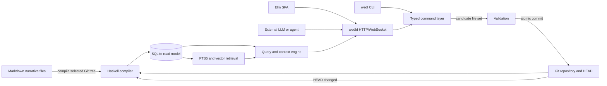
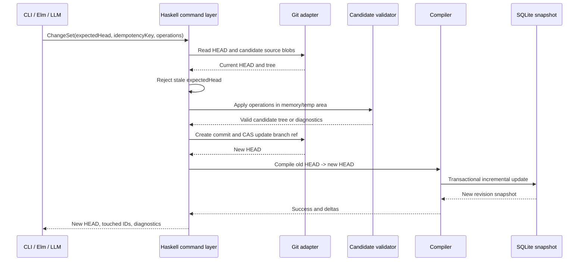

+++
schema = "adrai/decision/v1"
adr = "A01M48S4ZSCWHKWP8ZXFZ3HQJB2"
record = "R01M494TGES9D9H76YP16Y5YJ5A"
title = "Historical Haskell and Elm architecture proposal"
summary = "Migrated ARCHITECTURE contract and provenance; architecture is maintained through ADRAI."
domains = ["architecture-history"]
+++

## Authority and provenance

Migrated from `docs/ARCHITECTURE.md` at Git revision `996f5d18b4d982fd67c777ff833c667d80e83e29`. This relocation records existing documentation; it does not create a new historical approval. Named approvals and separately owned domain decisions retain their authority.

Historical, nonnormative proposal only. The original text is retained for rationale and provenance, including its deployment/component/retention/transport proposals and provisional source claims. Its current-looking annotations are statements made in that archived edition, not today's product interface. It does not authorize Haskell/Elm, blanket unknown-field rejection, source v0.1, or body byte preservation on legacy serializer paths. The current contracts above are separately discoverable through ADRAI. This record will be marked obsolete with the current source-format record as replacement.

# Historical Architecture Proposal (Archived)

> **Current chronology release boundary:** v0.6 chronology is active; a
> homogeneous v0.3/v0.5 repository uses local confirmed `upgrade-v06` and
> SQLite is disposable/rebuilt. API and UI clients discover capability only;
> they never migrate source. StoryTime remains ordering, never elapsed time.

> **Status:** This is a pre-0.6 Haskell/Elm design proposal, retained only for
> historical context. It does not describe the implemented Python CLI, server,
> or supported mutation protocol. In particular, its `wedld`, Elm, `--json`,
> and typed-Haskell-command claims are not current commands or guarantees. Use
> [command-line usage](../../../../docs/guides/command-line.md); implemented command contract ADRAI A01M494PM59C6BG1W7K1CXXYR0H, `wedl --help`,
> and the source code for current behavior.
>
> **Current temporal policy:** WEDL's implemented story time is a unitless
> ordinal `(timeline, tick, order)` coordinate. It has no calendar or duration
> conversion; optional timeline origins are descriptive rather than lower
> bounds, and bounded intervals are inclusive. See
> `SEMANTICS.md` (read with `adrai --repo . show A01M48RYDXG6N84N3XSTH44WS81 --json`) for the current contract.

## 1. Purpose

wedl manages an interactive narrative as versioned source data. It is optimized for two related uses:

1. **Writer introspection:** a human explores and edits characters, events, knowledge, relationships, scenes, and unresolved narrative machinery through Markdown, a CLI, or an Elm application.
2. **Character-grounded LLM interaction:** an external model requests a context bundle for a specific character in a specific scene, writes or roleplays using that context, and returns a structured change set that the application validates and commits.

The application is not itself an LLM host. It is the narrative state, retrieval, validation, and mutation system surrounding an LLM.

## 2. Architectural principles

### Git tree as world state

A world state is the contents of the managed source tree at a Git commit. A branch is an alternate line of world development. `HEAD` identifies the world revision currently selected by the CLI, backend, and UI.

Git history answers questions such as “who changed this record?” and “what did this branch contain at commit X?” Fictional chronology is represented separately by explicit story-time fields.

### Markdown for authorship; SQLite for execution

Each narrative record is one Markdown file with YAML frontmatter and a Markdown body. The body holds prose, notes, quotations, sensory description, and author guidance. Frontmatter holds typed, referential, and temporal data.

SQLite is a compiled read model. It exists to make the repository fast to validate, search, traverse, and query. It may contain normalized tables, derived snapshots, FTS indexes, embedding vectors, and trigger-evaluation data that would be unpleasant to maintain by hand.

### One command layer

All supported mutations pass through a typed Haskell command layer. `wedl`, `wedld`, the Elm frontend, and an LLM adapter invoke the same functions. The server never constructs shell command strings from browser input, and the frontend never directly edits files or SQLite rows.

### Explicit perspective boundaries

The author view, character view, and mixed dramatic-irony view are distinct query modes. Character mode can use only:

- Active knowledge belonging to that character as of the scene time.
- Explicit shared or private scene observations available to that character.
- Safe identity and relationship information already represented in that character’s knowledge.
- Derived state that is directly observable in the current scene and explicitly marked as such.

Global event prose, hidden story points, private notes, other characters’ knowledge, and author-only truth are excluded before retrieval.

### Deterministic narrative mechanics

Story-point eligibility and current state are deterministic functions of the compiled world and selected scene. Trigger evaluation has no I/O, randomness, model call, or arbitrary user code. Automatic activation is opt-in and still results in a normal, reviewable mutation commit.

## 3. System context



## 4. Components

### 4.1 `wedl-core`

Pure domain types and validation rules:

- Typed IDs and entity kinds.
- Story-time positions.
- Knowledge and relationship transitions.
- Event effects and state-key schemas.
- Scene visibility.
- Story-point trigger AST and lifecycle.
- Cross-entity invariants.
- Versioned command and query payloads.

This package must not depend on Git, SQLite, HTTP, or the filesystem.

### 4.2 `wedl-markdown`

Parses and canonically serializes the managed Markdown format:

- YAML frontmatter decoding.
- Strict schema validation with an `x-` namespace for extensions.
- Body and heading extraction.
- Reference discovery.
- Canonical key ordering for tool-generated files.
- Provenance decoding and regeneration.
- Golden round-trip tests.

### 4.3 `wedl-git`

Provides repository and revision operations:

- Repository and worktree discovery.
- Managed-tree snapshots at arbitrary commits.
- Blob and tree reads without checking out another revision.
- Ancestor and diff calculations.
- Compare-and-swap ref updates.
- Temporary-index or plumbing-based commits that do not capture unrelated staged files.
- Branch-aware commit messages and transaction trailers.
- Worktree-safe local locking.

### 4.4 `wedl-compiler`

Turns a Git tree into a validated SQLite snapshot:

- Full build from a selected commit.
- No-op when the database already represents the same revision and compiler fingerprint.
- Incremental update when the cached revision is an ancestor of the target revision.
- Changed-file parsing by Git blob ID.
- Referential and semantic validation.
- Recalculation of affected temporal snapshots, trigger dependencies, FTS documents, and embeddings.
- Atomic promotion of a successful compiled database.

### 4.5 `wedl-db`

Owns the disposable SQLite schema, query primitives, and materialized read models. Source migrations are explicit local Git transactions; incompatible derived databases are never migrated in place and are rebuilt from Git source. Callers use typed query functions rather than depending on ad hoc SQL.

Validated `wedl/v0.6` chronology sources compile into disposable SQLite calendar,
era, anchor, and annotation indexes used by internal typed reads and the
public `wedl-chronology/v1` surface. Confirmed full-replacement authoring is
available through the ordinary changeset workflow; `upgrade-v06` remains
active and local-only. v0.3/v0.5 readers remain pinned and v0.4 is recovery-only.

### 4.6 `wedl-query`

Builds writer and character context:

- Character knowledge as of a scene.
- Character-interaction history.
- Relevant events, objects, locations, and environments.
- Relationship snapshots.
- Hybrid FTS/vector retrieval.
- Graph expansion over explicit references.
- Token- or character-budgeted context assembly.
- Clear source citations back to entity IDs, files, and Git blobs.

### 4.7 `wedl-command`

Implements mutation use cases:

- CRUD for source entities.
- Record an event and its consequences as one transaction.
- Append knowledge and relationship transitions.
- Open or close a scene.
- Evaluate, activate, resolve, fail, or cancel a story point.
- Apply an LLM `ChangeSet`.
- Validate the complete candidate tree before committing.
- Compile the new `HEAD` after a successful commit.

### 4.8 `wedl`

The command-line application. Every command has human-readable output and a stable `--json` form. The CLI is suitable for humans, shell integration, tests, and model tool adapters.

### 4.9 `wedld`

A local Haskell HTTP/WebSocket server:

- Binds to loopback by default.
- Is launched for one repository/worktree.
- Serializes mutations through a single writer queue.
- Serves immutable revision-stamped reads concurrently.
- Watches the Git ref and managed source tree, recompiles after debouncing, and broadcasts state changes.
- Embeds or serves the compiled Elm assets.
- Exposes typed commands rather than arbitrary process execution.

### 4.10 Elm frontend

A revision-aware SPA for inspection and CRUD:

- Repository dashboard and compile status.
- Entity explorer and forms.
- Character perspective inspector.
- Timeline and interaction views.
- Current-scene workspace.
- Story-point dependency and eligibility view.
- Hybrid search.
- Validation errors with source locations.
- Live refresh through WebSocket messages.

## 5. Source and generated layout

```text
repository/
├── story/
│   ├── world.md
│   ├── characters/
│   ├── knowledge/
│   ├── events/
│   ├── objects/
│   ├── environments/
│   ├── locations/
│   ├── relationships/
│   ├── story-points/
│   └── scenes/
├── .wedl/                 # ignored, local to this worktree
│   ├── world.sqlite
│   ├── object-cache.sqlite
│   ├── revisions/
│   ├── session.json
│   ├── lock
│   └── logs/
├── stack.yaml
├── package.yaml or *.cabal
└── .gitignore
```

The source root is configurable, but `story/` is the default. Generated files are never required for cloning, review, or rebuilding the world.

## 6. Revision and mutation model

A logical mutation is a `ChangeSet`. It may touch several records, but it produces one Git commit.



Important properties:

- The current branch ref is updated only if it still equals `expectedHead`.
- A duplicate idempotency key returns the existing transaction result.
- Unrelated staged or unstaged files are not included.
- The complete candidate world is validated, not merely the touched records.
- If compilation fails unexpectedly after the Git commit, Git remains authoritative; the server reports the database as stale and retries or performs a full rebuild. Queries do not silently pretend the previous database represents the new `HEAD`.

## 7. Compilation and cache strategy

The compiled database records:

- Target commit and tree IDs.
- Compiler and schema fingerprints.
- Source path, blob ID, parsed entity ID, and parse result.
- Embedding profile and chunk hashes.
- Last successful validation summary.

Compilation chooses one of four paths:

1. **Exact hit:** target commit and fingerprints match; return immediately.
2. **Fast-forward/incremental:** cached commit is an ancestor of target; diff the two trees and recompile changed managed paths. Intervening merge commits do not require replay if the final tree diff is sufficient.
3. **Retained revision:** a database for the target commit exists in the revision cache; promote or open it.
4. **Full rebuild:** branch divergence, incompatible schema/compiler fingerprint, corrupt cache, or failed incremental validation.

A blob/object cache is shared within the worktree and keyed by immutable Git blob IDs, parser version, chunker version, embedding model, and vector dimensions. Branch switching can therefore reuse parsing and embeddings even when a full relational snapshot must be rebuilt.

Cache retention is controlled only by a revision count, matching the ADRAI pattern. The active database plus the most recent configured number of snapshots are retained. All cache files are disposable.

## 8. Temporal model

The initial fictional-time key is:

```text
(timeline ID, tick: signed 64-bit integer, order: signed 32-bit integer)
```

A tick is narrative order, not necessarily a real duration. An optional label or ISO timestamp may be displayed, but ordering uses the numeric key. This provides deterministic “as of scene” queries without confusing Git commit time with story time.

Events occur at one time key in v0.1. Scenes have a start key and an optional end key. Active v0.6 adds explicit calendars and uncertainty without changing StoryTime ordering.

## 9. Knowledge and state flow

Character knowledge is represented by a knowledge record containing one proposition and an append-only list of epistemic transitions. The active transition at a scene is the greatest transition not after the scene time.

Events may contain typed state effects for characters, objects, locations, and environments. Relationship and knowledge transitions reference the event that caused them. The database derives reverse links; the same fact is not duplicated into every source file.

Participation in an event does not imply knowledge. A character learns something only when a knowledge transition says that they observed, were told, inferred, read, remembered, or otherwise acquired it.

## 10. Search architecture

Each searchable entity or subdocument is converted to one or more search chunks. Chunks are indexed in FTS5 and, when an embedding provider is configured, in a vector table.

The initial vector implementation stores normalized `Float32` vectors in SQLite and performs an exact filtered cosine scan in Haskell. This is simple, deterministic, and sufficient for an initial narrative corpus. An optional SQLite vector extension or external ANN index may be added later behind the same interface.

Hybrid ranking uses reciprocal-rank fusion over:

- FTS5/BM25 results.
- Vector similarity results.
- Optional graph-neighbor boosts.
- Recency or scene relevance, where explicitly requested.

No in-process ONNX runtime is part of the core. Embeddings come from an explicitly configured local command or HTTP provider. Text is never sent to a remote provider without an explicit repository or user configuration.

## 11. Backend consistency model

Every read response includes:

- `revision`: Git commit represented by the response.
- `databaseRevision`: commit represented by SQLite.
- `stale`: whether they differ.
- `schemaVersion`.

Every mutation request includes `expectedHead`. A stale client receives a conflict response and must refresh. The server keeps one writer queue, while reads use SQLite snapshot isolation. WebSocket messages announce compile state, revision changes, touched entity IDs, and validation errors.

## 12. Security and trust boundaries

- The local server binds to `127.0.0.1` by default and uses a random session token.
- The browser cannot ask the server to run arbitrary executables or shell text.
- Repository paths are canonicalized and constrained to the selected worktree.
- Markdown is rendered with raw HTML disabled by default.
- LLM content is untrusted input and passes through the same schema and invariant validation as UI input.
- Provenance metadata is descriptive, not cryptographic proof. Git object IDs are authoritative for exact content.
- Character-mode search applies access filtering before retrieval to prevent hidden-text leakage.
- Remote embedding or LLM providers are opt-in and visibly configured.

## 13. Initial deployment model

The first release is a single self-contained Haskell distribution plus static Elm assets:

```text
wedl init
wedl compile
wedl serve
```

For the narrow documented source-schema transitions, `wedl migrate` is a
local-only, preview-confirmed Git transaction. It rewrites Markdown in a
forward commit and rebuilds SQLite; it never performs an in-place database
migration or exposes a server endpoint.

`wedl serve` may launch the server implementation in-process or delegate to `wedld`. Windows, Linux, and macOS packages should contain no separate Node runtime in normal use. Node/Elm tooling is needed only for frontend development.

## 14. Out-of-scope capabilities

The initial architecture intentionally does not promise:

- Real-time multi-user editing.
- A general rule language or arbitrary scripts.
- Automatic inference of what every witness perceived.
- Automatic generation of canonical events from prose.
- Rich physical simulation or pathfinding.
- Cross-repository entity references.
- Semantic merge resolution for conflicting narrative edits.
- Multiple simultaneous active scenes on one branch.
- Backward compatibility between pre-1.0 schema experiments.

These may be added only after the core perspective, temporal, and transactional semantics are proven.

## Python 0.5 search-profile refinement

The runnable implementation now treats search projection as an explicit
operational profile: `state`, `fts`, `vector`, or `hybrid`. FTS5 and dense-vector
retrieval are independent authorized lanes; hybrid mode fuses their unions
rather than using lexical results as the vector candidate set. Vectors are
L2-normalized, stored once per model/content hash, and linked to documents.
The default local provider is TF-IDF plus truncated SVD, with optional
sentence-transformers and OpenAI-compatible providers. See
`SEARCH_PROFILES.md` (read with `adrai --repo . show A01M48RW32X6AEHK2376V4YH3KP --json`).


## Original provisional semantic questions

## 15. Open semantic questions

These decisions should be revisited after the first end-to-end toy story:

1. Whether propositions deserve first-class source files rather than being embedded in knowledge records.
2. Whether canonical truth should be an explicit Fact entity instead of an optional proposition annotation.
3. Whether event duration and overlapping events are needed in the baseline event model.
4. Whether concurrent fronts need an optional author-named strand layer beyond
   their shared cursor, place, and cast projections.
5. Whether story-point automatic activation belongs in the first release.
6. How rich the relationship metric schema should be.
7. Whether draft records should be branch-local conventions or explicit statuses.
8. Whether retcons should use replacement events, event revisions, or both.
9. Whether scene observations should be independently addressable records.
10. How to represent uncertain or partially ordered fictional dates beyond numeric timeline ticks.


## Historical source-format intentions

# Markdown Source Format

## 1. Repository tree

The default managed tree is:

```text
story/
├── world.md
├── characters/
│   └── <slug>--<id>.md
├── knowledge/
│   └── <character-slug>/
│       └── <claim-slug>--<id>.md
├── events/
│   └── <timeline>/
│       └── <event-slug>--<id>.md
├── objects/
├── environments/
├── locations/
├── relationships/
├── story-points/
│   └── <domain path>/
└── scenes/
```

Folders are organizational. The compiler identifies records by frontmatter, not by path. Moving or renaming a file does not change identity.

Schema upgrades are source transactions, not SQLite migrations. For the
supported local-only v0.3/v0.4 paths, inspect a confirmed `wedl migrate`
preview before applying it; the compiled database remains disposable. See
[Migration and recovery usage](../../../../docs/guides/migration-and-recovery.md); normative recovery contract ADRAI A01M494PZVEJB05Y3RDNHAAKMWD (read with `adrai --repo WEDL_SOURCE_CHECKOUT show A01M494PZVEJB05Y3RDNHAAKMWD --json` in the WEDL development/source checkout).

`wedl/v0.6` chronology source is loaded and validated, then compiled into the
disposable internal chronology read model. The public `wedl-chronology/v1`
read and confirmed full-replacement authoring interfaces use that source model;
they do not alter ordinal timeline semantics or provide an upgrade workflow.
See the chronology schema contract ADRAI A01M48XWQD0809VQ3RD9NBYPSKB (read with `adrai --repo WEDL_SOURCE_CHECKOUT show A01M48XWQD0809VQ3RD9NBYPSKB --json` in the WEDL development/source checkout).

## 2. File envelope

Every record is a UTF-8 Markdown file with one YAML frontmatter document:

```markdown
---
schema: wedl/v0.1
kind: character
id: char_01K...
title: Mara Vale
domain: cast.archive
status: canonical
tags: [archivist, protagonist]
aliases: [Mara]
provenance: eyJ2IjoxLCJ0eCI6Ii4uLiJ9
---

# Mara Vale

Free-form Markdown body.
```

The parser rejects multiple frontmatter blocks, duplicate YAML keys, invalid UTF-8, and unsupported schema/kind combinations.

## 3. Common fields

| Field | Required | Meaning |
|---|---:|---|
| `schema` | yes | Versioned format identifier. Pre-1.0 schemas may change without compatibility promises. |
| `kind` | yes | `world`, `character`, `knowledge`, `event`, `object`, `environment`, `location`, `relationship`, `story-point`, or `scene`. |
| `id` | yes | Stable typed ID generated by `wedl`. |
| `title` | yes | Human display label. Not an identifier. |
| `domain` | yes | One dotted organizational path such as `cast.archive` or `plot.letter`. |
| `status` | yes | Kind-specific lifecycle status. |
| `tags` | no | Flat search and filtering labels. |
| `aliases` | no | Alternate names used by search and reference resolution in the UI. |
| `provenance` | tool writes | Base64url-encoded compact JSON describing the last tool-managed mutation. |

Entity-specific fields are described in `SEMANTICS.md` (read with `adrai --repo . show A01M48RYDXG6N84N3XSTH44WS81 --json`) and demonstrated in the original `docs/examples/` location (a historical illustrative path).

## 4. IDs

The default ID format is:

```text
<kind-prefix>_<26-character Crockford Base32 value>
```

Examples:

```text
char_01K2M3N4P5Q6R7S8T9V0W1X2Y3
event_01K2M3N4P5Q6R7S8T9V0W1X2Y4
```

IDs are opaque after creation. References always use the full ID. A later rename changes only the title, aliases, and path.

The CLI may accept a unique title or short ID interactively, but serialized source and machine APIs use full IDs.

## 5. World configuration

`story/world.md` is a normal source record that declares repository-wide narrative schemas:

- Default timeline and timeline labels. Each `timelines` declaration has an
  `id` and `label`, and may add an `origin` mapping with a signed integer
  `tick` plus display `label`:

  ```yaml
  default_timeline: main
  timelines:
    - id: main
      label: Campaign chronology
      origin:
        tick: 0
        label: Arrival at Harrowcross
  ```

  This origin is descriptive only, not the first permitted tick. A record may
  still use `tick: -20` for pre-origin history. Ticks are unitless ordering
  coordinates, so do not add date, duration, or conversion configuration to
  this declaration. Put external calendar references in the validated
  chronology declaration; narrative prose remains in Markdown bodies instead.
- Allowed state keys by entity kind.
- Relationship metric names and ranges.
- Default domains.
- Search chunking parameters.
- Embedding policy and model identity.
- Optional extension schemas.

Operational settings that should not be committed—server port, local embedding endpoint credentials, selected scene, cache retention override—live in Git config or `.wedl/session.json`.

## 6. Canonical serialization

Tool-generated frontmatter uses:

- UTF-8 and LF line endings.
- Two-space YAML indentation.
- Stable common-field ordering.
- Stable ordering for map keys where order has no semantic meaning.
- Explicit arrays rather than comma-delimited strings.
- Quoted strings when YAML could coerce a value.
- Decimal confidence values in the inclusive range `0.0` to `1.0`.
- Full IDs for references.

The Markdown body is preserved byte-for-byte when a command changes only frontmatter, except for a final newline normalization.

Unknown fields are errors unless they begin with `x-`. Extension fields are preserved and indexed as metadata but have no core semantics.

## 7. Provenance

The `provenance` value is base64url-encoded compact JSON similar to:

```json
{
  "v": 1,
  "tx": "tx_01K...",
  "command": "event.record",
  "actor": "local:kyle",
  "generator": "wedl/0.1.0",
  "requestHash": "sha256:...",
  "parent": "<expected Git commit>"
}
```

Rules:

- The command layer rewrites provenance on every touched record.
- The value is descriptive and compact; it is not trusted as a signature.
- The compiler also records the containing Git commit, tree, blob ID, and path.
- Direct manual edits may retain stale provenance. Git remains authoritative, and validation reports the record as externally edited rather than rejecting it solely for that reason.
- A future signing layer may attest commits without changing entity semantics.

## 8. Markdown body conventions

Bodies are deliberately flexible. The initial UI recognizes optional headings such as:

- `## Summary`
- `## Appearance`
- `## Voice`
- `## Goals`
- `## History`
- `## Sensory details`
- `## Author notes`
- `## Constraints`

These headings improve chunking and forms but are not required unless a kind-specific schema says otherwise.

Raw HTML is not rendered by default. Links to other entities should use an ID-aware form:

```markdown
[Oren Thane](story:char_01K...)
```

The compiler extracts these links into `entity_ref`. Ordinary relative Markdown links remain ordinary files and are not treated as narrative references.

## 9. Kind-specific source patterns

### Character

Static identity, initial state, voice, author notes. Current state comes from event effects.

### Knowledge

One knower, one proposition, ordered transitions. The body may explain context, ambiguity, or how the belief affects behavior.

### Event

One important occurrence at one story-time position, participants, location, and typed state effects.

Time ranges on scenes, environments, participants, observations, and
conversations include both declared endpoints. For example, a participant with
`from: {timeline: main, tick: -20, order: 0}` and `to: {timeline: main,
tick: 5, order: 0}` is present at both points. Same-tick ordering uses the
signed integer `order`; WEDL assigns no real-world duration to a tick.

### Object

Persistent identity and initial state. Current holder/location/condition is derived.

### Environment

Time-bounded conditions applied to locations or scenes.

### Location

Stable spatial node, parent, exits, and enduring description.

### Relationship

One directed edge and ordered transitions. Paired inverse records are explicit.

### Story point

Definition, dependencies, trigger AST, activation policy, and committed lifecycle transitions.

### Scene

Writing context with participants, point of view, observations, and links to active narrative machinery.

## 10. Direct editing and supported writes

Markdown remains human-readable and may be edited manually. However:

- `wedl` is the supported write interface for atomic multi-record operations.
- The Elm UI and LLM integrations always use commands.
- Direct edits must be committed normally and then pass `wedl validate`.
- Direct edits do not gain tool transaction metadata unless adopted by a dedicated command.
- The compiler never rewrites manually edited bodies merely to normalize style.

## 11. Git commit convention

A tool-created mutation uses a concise subject and structured trailers:

```text
wedl: record the archive exchange

Wedl-Tx: tx_01K...
Wedl-Command: event.record
Wedl-Schema: wedl/v0.1
Wedl-Entities: event_...,know_...,rel_...
```

One logical transaction is one commit, even when it creates or changes several files.

The Git adapter must not include unrelated index contents. It should use a temporary index or Git plumbing and update the branch ref with compare-and-swap semantics.

## 12. Merge behavior

Git resolves text merges. wedl adds semantic validation after a merge:

- Duplicate IDs are errors.
- Divergent transitions in one append-only list must be ordered or explicitly reconciled.
- Two events assigning incompatible state at the same story-time position are errors.
- Story-point dependency cycles introduced by merged branches are errors.
- An active-scene conflict is an error.

v0.1 reports these conflicts but does not attempt an automatic semantic merge. A later `wedl reconcile` command may assist with common cases.

## 13. Example corpus

### Latent spatial component boundary

The accepted spatial v0.7 component preserves Markdown bodies exactly during a
frontmatter round trip: only the single envelope separator blank line is
consumed.  It remains a component validator, not generic v0.7 parser,
compiler, migration, CLI, HTTP, or UI acceptance.

The the original `docs/examples/` location (a historical illustrative path) directory contains the expanded **Ash Archive** world: a deterministic 120-record corpus spanning every v0.1 entity kind. Its IDs and base64url provenance payloads are structurally valid, and its frontmatter/reference graph is checked as part of packaging. The corpus is intended both as schema illustration and as the primary provisional integration fixture; it may still evolve until the pre-1.0 source schema is frozen.

<!-- @adrai:eyJhIjp7ImkiOiJkb2NzLWNsZWFudXAtZGV2ZWxvcGVyIiwiayI6ImxsbSIsIm0iOiJncHQtNi4xLXNvbCJ9LCJiIjoiNTI2OGQ2MDI5NjNmNTBmYzVjOWI5MGYzYjQ2MmViOTVhNmM2ZDJjYiIsImkiOiJzaGEyNTY6STVJVm82aV9nWXAzUlJ5Y3BEM1FIcXhOS2EyYzJRZG9JVC1RWXBybFhiWSIsImsiOiJkZWNpc2lvbi5hbWVuZCIsIm8iOiJSMDFNNDk0VEdFUzlEOUg3NllQMTZZNVlKNUEiLCJvcCI6Ik8wMU00OTRUR0VTOUQ5SDc2WVAxNlk1WUo1QSIsInAiOlsiUjAxTTQ4UzUwUTdWNU1aMDcxWEVGQTFRNzdGIl0sInIiOiJtYXN0ZXIiLCJzIjoic2hhMjU2OmF0U1RCTXM2bVVaZW4ydk5VSVFRRUxaOUpMbVFDMVFrNlVTUW4xNzl6UUUiLCJ0IjoxNzkxMzA4NDE1NDQ5LCJ2IjoxLCJ4IjoiYWRyYWkvMS4wLjAifQ -->
