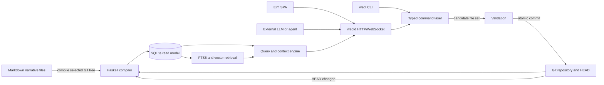
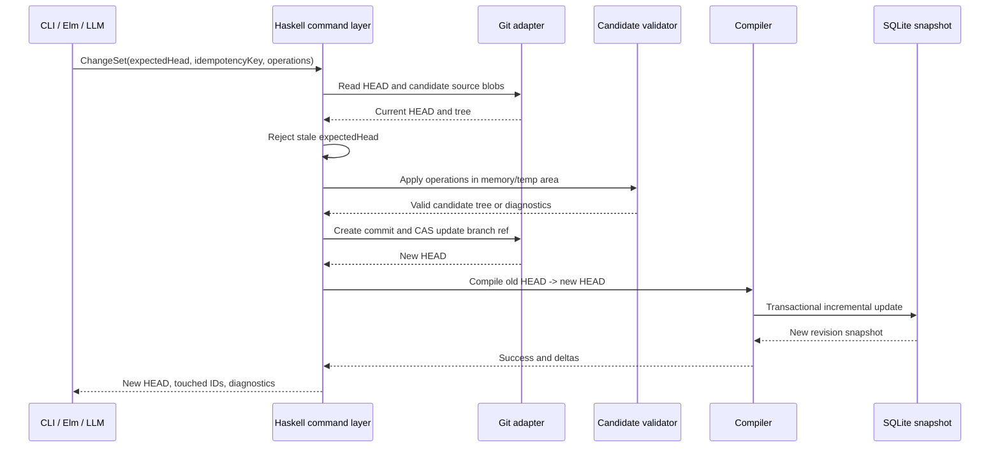

# Historical Architecture Proposal (Archived)

> **Current chronology release boundary:** v0.6 chronology is active; a
> homogeneous v0.3/v0.5 repository uses local confirmed `upgrade-v06` and
> SQLite is disposable/rebuilt. API and UI clients discover capability only;
> they never migrate source. StoryTime remains ordering, never elapsed time.

> **Status:** This is a pre-0.6 Haskell/Elm design proposal, retained only for
> historical context. It does not describe the implemented Python CLI, server,
> or supported mutation protocol. In particular, its `wedld`, Elm, `--json`,
> and typed-Haskell-command claims are not current commands or guarantees. Use
> [`LLM_AND_COMMAND_PROTOCOL.md`](LLM_AND_COMMAND_PROTOCOL.md), `wedl --help`,
> and the source code for current behavior.
>
> **Current temporal policy:** WEDL's implemented story time is a unitless
> ordinal `(timeline, tick, order)` coordinate. It has no calendar or duration
> conversion; optional timeline origins are descriptive rather than lower
> bounds, and bounded intervals are inclusive. See
> [`SEMANTICS.md`](SEMANTICS.md#story-time) for the current contract.

## 1. Purpose

wedl manages an interactive narrative as versioned source data. It is optimized for two related uses:

1. **Writer introspection:** a human explores and edits characters, events, knowledge, relationships, scenes, and unresolved narrative machinery through Markdown, a CLI, or an Elm application.
2. **Character-grounded LLM interaction:** an external model requests a context bundle for a specific character in a specific scene, writes or roleplays using that context, and returns a structured change set that the application validates and commits.

The application is not itself an LLM host. It is the narrative state, retrieval, validation, and mutation system surrounding an LLM.

## 2. Architectural principles

### Git tree as world state

A world state is the contents of the managed source tree at a Git commit. A branch is an alternate line of world development. `HEAD` identifies the world revision currently selected by the CLI, backend, and UI.

Git history answers questions such as “who changed this record?” and “what did this branch contain at commit X?” Fictional chronology is represented separately by explicit story-time fields.

### Markdown for authorship; SQLite for execution

Each narrative record is one Markdown file with YAML frontmatter and a Markdown body. The body holds prose, notes, quotations, sensory description, and author guidance. Frontmatter holds typed, referential, and temporal data.

SQLite is a compiled read model. It exists to make the repository fast to validate, search, traverse, and query. It may contain normalized tables, derived snapshots, FTS indexes, embedding vectors, and trigger-evaluation data that would be unpleasant to maintain by hand.

### One command layer

All supported mutations pass through a typed Haskell command layer. `wedl`, `wedld`, the Elm frontend, and an LLM adapter invoke the same functions. The server never constructs shell command strings from browser input, and the frontend never directly edits files or SQLite rows.

### Explicit perspective boundaries

The author view, character view, and mixed dramatic-irony view are distinct query modes. Character mode can use only:

- Active knowledge belonging to that character as of the scene time.
- Explicit shared or private scene observations available to that character.
- Safe identity and relationship information already represented in that character’s knowledge.
- Derived state that is directly observable in the current scene and explicitly marked as such.

Global event prose, hidden story points, private notes, other characters’ knowledge, and author-only truth are excluded before retrieval.

### Deterministic narrative mechanics

Story-point eligibility and current state are deterministic functions of the compiled world and selected scene. Trigger evaluation has no I/O, randomness, model call, or arbitrary user code. Automatic activation is opt-in and still results in a normal, reviewable mutation commit.

## 3. System context



## 4. Components

### 4.1 `wedl-core`

Pure domain types and validation rules:

- Typed IDs and entity kinds.
- Story-time positions.
- Knowledge and relationship transitions.
- Event effects and state-key schemas.
- Scene visibility.
- Story-point trigger AST and lifecycle.
- Cross-entity invariants.
- Versioned command and query payloads.

This package must not depend on Git, SQLite, HTTP, or the filesystem.

### 4.2 `wedl-markdown`

Parses and canonically serializes the managed Markdown format:

- YAML frontmatter decoding.
- Strict schema validation with an `x-` namespace for extensions.
- Body and heading extraction.
- Reference discovery.
- Canonical key ordering for tool-generated files.
- Provenance decoding and regeneration.
- Golden round-trip tests.

### 4.3 `wedl-git`

Provides repository and revision operations:

- Repository and worktree discovery.
- Managed-tree snapshots at arbitrary commits.
- Blob and tree reads without checking out another revision.
- Ancestor and diff calculations.
- Compare-and-swap ref updates.
- Temporary-index or plumbing-based commits that do not capture unrelated staged files.
- Branch-aware commit messages and transaction trailers.
- Worktree-safe local locking.

### 4.4 `wedl-compiler`

Turns a Git tree into a validated SQLite snapshot:

- Full build from a selected commit.
- No-op when the database already represents the same revision and compiler fingerprint.
- Incremental update when the cached revision is an ancestor of the target revision.
- Changed-file parsing by Git blob ID.
- Referential and semantic validation.
- Recalculation of affected temporal snapshots, trigger dependencies, FTS documents, and embeddings.
- Atomic promotion of a successful compiled database.

### 4.5 `wedl-db`

Owns the disposable SQLite schema, query primitives, and materialized read models. Source migrations are explicit local Git transactions; incompatible derived databases are never migrated in place and are rebuilt from Git source. Callers use typed query functions rather than depending on ad hoc SQL.

Validated `wedl/v0.6` chronology sources compile into disposable SQLite calendar,
era, anchor, and annotation indexes used by internal typed reads and the
public `wedl-chronology/v1` surface. Confirmed full-replacement authoring is
available through the ordinary changeset workflow; `upgrade-v06` remains
active and local-only. v0.3/v0.5 readers remain pinned and v0.4 is recovery-only.

### 4.6 `wedl-query`

Builds writer and character context:

- Character knowledge as of a scene.
- Character-interaction history.
- Relevant events, objects, locations, and environments.
- Relationship snapshots.
- Hybrid FTS/vector retrieval.
- Graph expansion over explicit references.
- Token- or character-budgeted context assembly.
- Clear source citations back to entity IDs, files, and Git blobs.

### 4.7 `wedl-command`

Implements mutation use cases:

- CRUD for source entities.
- Record an event and its consequences as one transaction.
- Append knowledge and relationship transitions.
- Open or close a scene.
- Evaluate, activate, resolve, fail, or cancel a story point.
- Apply an LLM `ChangeSet`.
- Validate the complete candidate tree before committing.
- Compile the new `HEAD` after a successful commit.

### 4.8 `wedl`

The command-line application. Every command has human-readable output and a stable `--json` form. The CLI is suitable for humans, shell integration, tests, and model tool adapters.

### 4.9 `wedld`

A local Haskell HTTP/WebSocket server:

- Binds to loopback by default.
- Is launched for one repository/worktree.
- Serializes mutations through a single writer queue.
- Serves immutable revision-stamped reads concurrently.
- Watches the Git ref and managed source tree, recompiles after debouncing, and broadcasts state changes.
- Embeds or serves the compiled Elm assets.
- Exposes typed commands rather than arbitrary process execution.

### 4.10 Elm frontend

A revision-aware SPA for inspection and CRUD:

- Repository dashboard and compile status.
- Entity explorer and forms.
- Character perspective inspector.
- Timeline and interaction views.
- Current-scene workspace.
- Story-point dependency and eligibility view.
- Hybrid search.
- Validation errors with source locations.
- Live refresh through WebSocket messages.

## 5. Source and generated layout

```text
repository/
├── story/
│   ├── world.md
│   ├── characters/
│   ├── knowledge/
│   ├── events/
│   ├── objects/
│   ├── environments/
│   ├── locations/
│   ├── relationships/
│   ├── story-points/
│   └── scenes/
├── .wedl/                 # ignored, local to this worktree
│   ├── world.sqlite
│   ├── object-cache.sqlite
│   ├── revisions/
│   ├── session.json
│   ├── lock
│   └── logs/
├── stack.yaml
├── package.yaml or *.cabal
└── .gitignore
```

The source root is configurable, but `story/` is the default. Generated files are never required for cloning, review, or rebuilding the world.

## 6. Revision and mutation model

A logical mutation is a `ChangeSet`. It may touch several records, but it produces one Git commit.



Important properties:

- The current branch ref is updated only if it still equals `expectedHead`.
- A duplicate idempotency key returns the existing transaction result.
- Unrelated staged or unstaged files are not included.
- The complete candidate world is validated, not merely the touched records.
- If compilation fails unexpectedly after the Git commit, Git remains authoritative; the server reports the database as stale and retries or performs a full rebuild. Queries do not silently pretend the previous database represents the new `HEAD`.

## 7. Compilation and cache strategy

The compiled database records:

- Target commit and tree IDs.
- Compiler and schema fingerprints.
- Source path, blob ID, parsed entity ID, and parse result.
- Embedding profile and chunk hashes.
- Last successful validation summary.

Compilation chooses one of four paths:

1. **Exact hit:** target commit and fingerprints match; return immediately.
2. **Fast-forward/incremental:** cached commit is an ancestor of target; diff the two trees and recompile changed managed paths. Intervening merge commits do not require replay if the final tree diff is sufficient.
3. **Retained revision:** a database for the target commit exists in the revision cache; promote or open it.
4. **Full rebuild:** branch divergence, incompatible schema/compiler fingerprint, corrupt cache, or failed incremental validation.

A blob/object cache is shared within the worktree and keyed by immutable Git blob IDs, parser version, chunker version, embedding model, and vector dimensions. Branch switching can therefore reuse parsing and embeddings even when a full relational snapshot must be rebuilt.

Cache retention is controlled only by a revision count, matching the ADRAI pattern. The active database plus the most recent configured number of snapshots are retained. All cache files are disposable.

## 8. Temporal model

The initial fictional-time key is:

```text
(timeline ID, tick: signed 64-bit integer, order: signed 32-bit integer)
```

A tick is narrative order, not necessarily a real duration. An optional label or ISO timestamp may be displayed, but ordering uses the numeric key. This provides deterministic “as of scene” queries without confusing Git commit time with story time.

Events occur at one time key in v0.1. Scenes have a start key and an optional end key. Active v0.6 adds explicit calendars and uncertainty without changing StoryTime ordering.

## 9. Knowledge and state flow

Character knowledge is represented by a knowledge record containing one proposition and an append-only list of epistemic transitions. The active transition at a scene is the greatest transition not after the scene time.

Events may contain typed state effects for characters, objects, locations, and environments. Relationship and knowledge transitions reference the event that caused them. The database derives reverse links; the same fact is not duplicated into every source file.

Participation in an event does not imply knowledge. A character learns something only when a knowledge transition says that they observed, were told, inferred, read, remembered, or otherwise acquired it.

## 10. Search architecture

Each searchable entity or subdocument is converted to one or more search chunks. Chunks are indexed in FTS5 and, when an embedding provider is configured, in a vector table.

The initial vector implementation stores normalized `Float32` vectors in SQLite and performs an exact filtered cosine scan in Haskell. This is simple, deterministic, and sufficient for an initial narrative corpus. An optional SQLite vector extension or external ANN index may be added later behind the same interface.

Hybrid ranking uses reciprocal-rank fusion over:

- FTS5/BM25 results.
- Vector similarity results.
- Optional graph-neighbor boosts.
- Recency or scene relevance, where explicitly requested.

No in-process ONNX runtime is part of the core. Embeddings come from an explicitly configured local command or HTTP provider. Text is never sent to a remote provider without an explicit repository or user configuration.

## 11. Backend consistency model

Every read response includes:

- `revision`: Git commit represented by the response.
- `databaseRevision`: commit represented by SQLite.
- `stale`: whether they differ.
- `schemaVersion`.

Every mutation request includes `expectedHead`. A stale client receives a conflict response and must refresh. The server keeps one writer queue, while reads use SQLite snapshot isolation. WebSocket messages announce compile state, revision changes, touched entity IDs, and validation errors.

## 12. Security and trust boundaries

- The local server binds to `127.0.0.1` by default and uses a random session token.
- The browser cannot ask the server to run arbitrary executables or shell text.
- Repository paths are canonicalized and constrained to the selected worktree.
- Markdown is rendered with raw HTML disabled by default.
- LLM content is untrusted input and passes through the same schema and invariant validation as UI input.
- Provenance metadata is descriptive, not cryptographic proof. Git object IDs are authoritative for exact content.
- Character-mode search applies access filtering before retrieval to prevent hidden-text leakage.
- Remote embedding or LLM providers are opt-in and visibly configured.

## 13. Initial deployment model

The first release is a single self-contained Haskell distribution plus static Elm assets:

```text
wedl init
wedl compile
wedl serve
```

For the narrow documented source-schema transitions, `wedl migrate` is a
local-only, preview-confirmed Git transaction. It rewrites Markdown in a
forward commit and rebuilds SQLite; it never performs an in-place database
migration or exposes a server endpoint.

`wedl serve` may launch the server implementation in-process or delegate to `wedld`. Windows, Linux, and macOS packages should contain no separate Node runtime in normal use. Node/Elm tooling is needed only for frontend development.

## 14. Out-of-scope capabilities

The initial architecture intentionally does not promise:

- Real-time multi-user editing.
- A general rule language or arbitrary scripts.
- Automatic inference of what every witness perceived.
- Automatic generation of canonical events from prose.
- Rich physical simulation or pathfinding.
- Cross-repository entity references.
- Semantic merge resolution for conflicting narrative edits.
- Multiple simultaneous active scenes on one branch.
- Backward compatibility between pre-1.0 schema experiments.

These may be added only after the core perspective, temporal, and transactional semantics are proven.

## Python 0.5 search-profile refinement

The runnable implementation now treats search projection as an explicit
operational profile: `state`, `fts`, `vector`, or `hybrid`. FTS5 and dense-vector
retrieval are independent authorized lanes; hybrid mode fuses their unions
rather than using lexical results as the vector candidate set. Vectors are
L2-normalized, stored once per model/content hash, and linked to documents.
The default local provider is TF-IDF plus truncated SVD, with optional
sentence-transformers and OpenAI-compatible providers. See
[`SEARCH_PROFILES.md`](SEARCH_PROFILES.md).
